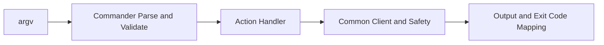

# 0007 - Standardize CLI Command Parsing with Commander

Date: 2026-02-24

## Status

Accepted

Amends [0003 - CLI Contract and Exit Codes](0003-cli-contract-and-exit-codes.md)

## Context

The CLI currently uses a custom top-level option parser and manual command dispatch. The implementation is small, but it duplicates argument validation and help behavior that are already well-supported by mature CLI libraries. As command surface grows, this increases maintenance cost and makes edge-case handling harder to keep consistent.

The project requires preserving the existing user-facing command contract for automation and scripts:

- `gemini-files [global options] files <action> ...`
- actions: `upload`, `list`, `get`, `delete`, `download`
- exit codes and safety mode behavior remain unchanged

## Decision

Adopt `commander` for `@gemini-file-tools/gemini-files-cli` command parsing and wiring.

Implementation constraints:

- Keep current command names, global options, and output semantics.
- Keep existing exit code mapping (`0/1/2/3/4/5`) and normalized error model.
- Keep safety mode enforcement in internal handlers, not in Commander-specific logic.
- Restrict dependency addition to the CLI package only.

## Consequences

Positive:

- Less custom parsing code to maintain.
- Better built-in validation, option handling, and command discoverability.
- Clearer separation between parsing/wiring and business operations.

Tradeoffs:

- Adds one runtime dependency (`commander`) to the CLI package.
- Requires regression tests to ensure behavior parity with the prior parser.

Risk mitigation:

- Preserve command contract and exit code mapping in tests.
- Keep action handlers focused on current business behavior to minimize drift.
