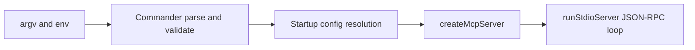

# 0008 - Standardize MCP Startup Configuration Parsing with Commander

Date: 2026-02-25

## Status

Accepted

Amends [0004 - MCP Stdio Tools Contract](0004-mcp-stdio-tools-contract.md)

## Context

The MCP server startup path currently relies only on environment variables and does not expose discoverable process-level option parsing. As a result, startup ergonomics are inconsistent with the CLI package and validation behavior is less explicit than needed for operators.

This change must preserve MCP protocol compatibility:

- JSON-RPC framing over stdio remains unchanged.
- Existing tool names, schemas, annotations, and behavior remain unchanged.
- Startup parsing should improve UX without changing MCP contract semantics.

There is also a compatibility concern: documentation has referenced `GOOGLE_API_KEY` while implementation has used `GEMINI_API_KEY`.

## Decision

Adopt `commander` in `@gemini-file-tools/gemini-files-mcp` for launcher startup options only.

- Add process options: `--api-key`, `--base-url`, `--timeout-ms`, `--safety-mode`, `--help`.
- Keep MCP runtime request handling in the existing JSON-RPC server implementation.
- Resolve startup configuration with precedence:
  - `--api-key` > `GEMINI_API_KEY` > `GOOGLE_API_KEY`
  - flags override environment variables for other startup options
- Keep default safety mode resolution behavior (`read-only`) when not explicitly set.

## Consequences

Positive:

- Better startup UX with discoverable and typed options.
- Improved parity with CLI startup ergonomics.
- Backward-compatible API key env handling.

Tradeoffs:

- Adds one runtime dependency (`commander`) to MCP package.
- Requires startup regression tests to ensure precedence and validation behavior.

Risk mitigation:

- Limit Commander usage to launcher only.
- Preserve MCP tool contract and server behavior unchanged.
- Verify behavior through focused startup tests and existing MCP tool tests.
